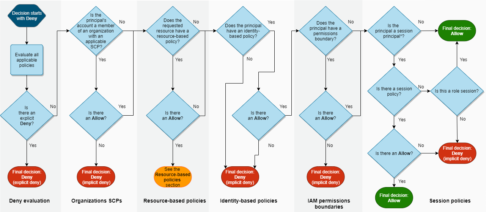
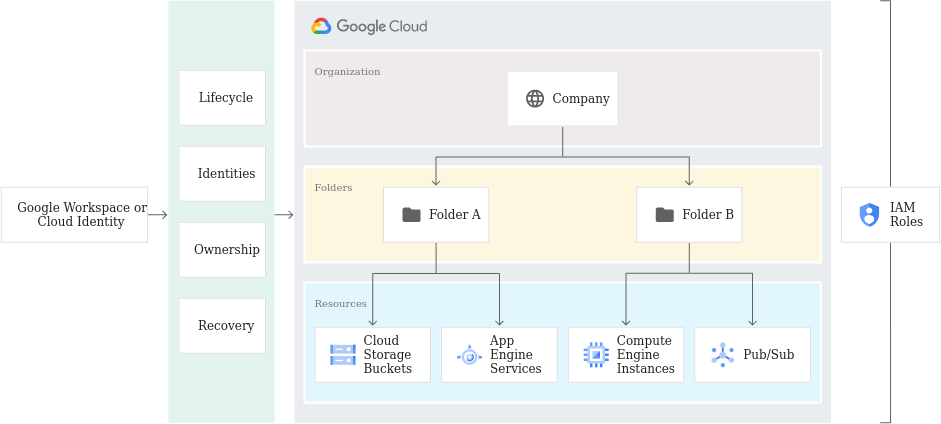

# AWS IAM Took the Wrong Exit

This is going to be a **highly** opinionated blog post. I think AWS is great and use it daily, but their implementation of IAM is unnecessarily complicated and getting worse.

>If you can't tolerate critics, don't do anything new or interesting.
> 
>*Jeff Bezos*

Let's get started.

The [policy evaluation logic](https://docs.aws.amazon.com/IAM/latest/UserGuide/reference_policies_evaluation-logic.html#policy-eval-denyallow) reads like a James Joyce novel:

Does it need to be this complex? Maybe not.

Because AWS is doubling down on a flawed Organizational model.

## A bit of history

We need to go back to the ~~history books~~ Wayback Machine to understand why things are so. [First](https://en.wikipedia.org/wiki/Timeline_of_Amazon_Web_Services) came the services (this [rant](https://gist.github.com/chitchcock/1281611) comes to mind) - S3, SQS and EC2. At that time, "Amazon Web Services" was hardly a "cloud provider", but rather a few disjointed building blocks. It took [many years](https://aws.amazon.com/blogs/aws/iam-identity-access-management/) for the current IAM service to be released. Back then this fit the purpose, namely managing authentication and authorization **in a single AWS account**.

The introduction of IAM came with 2 types of principals:
* Users, representing human actors
* Groups, a container for users allowing for "**role** based access control"

This new service included the concept of policies, which allowed defining what a principal could do (identity-based policies) as well as what a resource allowed for (resource-based policies).

A few years later, the "**roles** for EC2 instances" feature was [released](https://aws.amazon.com/blogs/aws/iam-roles-for-ec2-instances-simplified-secure-access-to-aws-service-apis-from-ec2/):

>Today we are introducing AWS Identity and Access management (IAM) roles for EC2 instances, a new feature that makes it even easier for you to securely access AWS service APIs from your EC2 instances. You can create an IAM role, assign it a set of permissions, launch EC2 instances with the IAM role, and then AWS access keys with the specified permissions are automatically made available on those EC2 instances.

Great, this makes sense - no more need to hardcode an IAM user's API keys in your applications and workloads!

This now meant we had a third type of principal:
* Roles, an "identity" that an instance, workload or application impersonates to gain API permissions

The implementation of this new principal required the ability to provide EC2 instances with temporary credentials. This was initially only available via the [EC2 Instance Metadata Service](http://docs.amazonwebservices.com/AWSEC2/latest/UserGuide/AESDG-chapter-instancedata.html), but was [later](https://aws.amazon.com/blogs/security/aws-security-token-service-is-now-available-in-every-aws-region/) generalized by the AWS Security Token Service (STS) service. With this new service, you could now easily get temporary credentials for any role. Neat!

As adoption of the cloud grew, organizations started to identify the need for using multiple AWS accounts. This posed a serious problem, because AWS' architecture didn't easily support managing access and permissions for multi-account scenarios. **This point** is where things started going downhill. Instead of properly refactoring the architecture, AWS did what AWS does best - it built a new service.

I can envision a meeting in an unmarked office building, downtown Seattle. A team is hashing out the details of the new "Organizations" service they've been tasked to build, allowing management of multiple accounts by a single company. They come to the topic AWS account access:
* Product Manager: *How are people going to authenticate to all these accounts?*
* Engineer: *Why don't we just use roles?*
* Product Manager: *Roles? I thought those were just for EC2?*
* Engineer: *Well you know, IAM roles can already be ~~impersonated~~ assumed by a principal in another account so... there's really nothing we need to add? Let's just use this mechanism to allow access to an Organization's sub-accounts and call it a day.*
* Product Manager: *But won't that be confusing? Since you know, roles are for **non-human workloads**?*
* Engineer: *Hey man, we can either do it this way or take 100x more time and re-architect the whole thing.*
* Product Manager: *Sold!*

And just like that, AWS Organizations as we know it was [born](https://aws.amazon.com/blogs/aws/aws-organizations-policy-based-management-for-multiple-aws-accounts/).

How does organizations implement sub-account access via roles? You create [permission sets](https://docs.aws.amazon.com/singlesignon/latest/userguide/permissionsetsconcept.html) in SSO, which are essentially IAM policies. When you "attach" a permission set to an SSO user or group **in a given sub-account**, Organizations will create a role in that account with the permissions defined in the set. 
Once the user (or member of the group) authenticates to SSO, they're presented with the accounts they can access by assuming the role created by the service. This does allow accessing accounts with different levels of permissions, which is nice.

A consequence of this change was to further remove any coherent meaning for the term "role", as it didn't strictly refer to:
* *programmatic identities*, since any principal (users, groups & roles) can potentially assume any role and Organizations relies on role assumption for sub-account access
* *federated identities* (as in IdP/SSO), since workloads as well as AWS services can assume a role
* **Role** Based Access Control (RBAC), which is a standard term in the industry (and is *the traditional authorization model used in IAM*[^1])
  * To be fair, this was an issue from the start

So **what** is an IAM role then? Simply put, it's a principal (i.e. an identity) with no long-lived credentials, that can be impersonated for arbitrary purposes.

## Looking around

All right, so we've established the [timeline](https://aws.amazon.com/blogs/aws/happy-10th-birthday-aws-identity-and-access-management/) for AWS IAM's progress, and asserted that AWS Organizations is when things went sideways. Could it have been any other way?

I think it would have, if AWS hadn't treated "multi-account management" as "just another service". So why did they?

>No problem can be solved from the same level of consciousness that created it.
> 
> *Albert Einstein*

This is where Google Cloud Platform, Google's (not-yet-canned 😅) cloud provider comes into play. GCP's infancy was similar to AWS' in that the [initial offering](https://en.wikipedia.org/wiki/Google_Cloud_Platform) was a single service, App Engine. But Google had two advantages over Amazon:
* By being released later (GA in 2011, the same year AWS launched IAM), they surely benefited from the ability to learn from AWS' achievements and mistakes.
    * They even copied things like the super unsafe and not really useful `allAuthenticatedUsers` bucket [ACL](https://cloud.google.com/storage/docs/access-control/lists#scopes), which AWS [highly recommends against using](https://docs.aws.amazon.com/AmazonS3/latest/userguide/managing-acls.html) (and have hidden away from the web console).
* Google already had the G Suite identity provider (now Google Workspace), removing the need for a new authentication mechanism.

The result? GCP's [Resource Hierarchy](https://cloud.google.com/resource-manager/docs/cloud-platform-resource-hierarchy):

>The purpose of the Google Cloud resource hierarchy is two-fold:
> - Provide a hierarchy of ownership, which binds the lifecycle of a resource to its immediate parent in the hierarchy.
> - Provide attach points and inheritance for access control and organization policies.
>
> Metaphorically speaking, the Google Cloud resource hierarchy resembles the file system found in traditional operating systems as a way of organizing and managing entities hierarchically. Generally, each resource has exactly one parent. **This hierarchical organization of resources enables you to set access control policies and configuration settings on a parent resource, and the policies and Identity and Access Management (IAM) settings are inherited by the child resources.**

The brilliant thing with this implementation is that it ties permissions (e.g. read access to storage buckets) to their location (e.g. the buckets in the `production` project), which provides context. Conversely in AWS, a set of permissions exists within the whole AWS account they belong to. You need to add specific `Conditions` , or to define the `Resources` to which the permissions apply to scope down access. And that's if you're creating the permissions yourself - AWS-Managed permissions will apply to everything in that account.

This resource hierarchy, which you get out of the box, also fosters better isolation of environments. I can't tell you how many times I've seen large, mature organizations have their production, staging and development environments in the same AWS account (often the Organization's management account, which is excluded from Security Control Policies). Compounded with the above, the end result is a proliferation of overly privileged principals.

What about the process required for a user to access the different levels of the hierarchy? Easy - if a user has permissions granted in that project (it's really *if a user is assigned a **role** in that project*, but we're already confused enough with the terminology), then he can use those permissions. No need for additional principals, role assumption chains or overly complex edge cases that [almost no one understands](https://ermetic.com/blog/aws/diving-deeply-into-iam-policy-evaluation-highlights-from-aws-reinforce-session-iam433/).

And when it comes to security, simpler often leads to safer.

### GCP is not a panacea

GCP IAM is definitely not perfect. When auditing GCP organizations we often find issues such as:

1. Too many permissions granted at the Organizational node, which are then inherited by the rest of the resource tree
2. Lack of a defined resource hierarchy, which limits assigning roles in a manner that adheres to the principle of least privilege
3. An overuse of basic roles, granting too many permissions

The difference is that these are configuration flaws, which are easier to fix as they are mostly about not making the most out of GCP's resource hierarchy, rather than the architecture forcing complexity and misconfigurations.

To remediate the above:
1. Grant permissions closer to where they are needed
2. Restructure the resource hierarchy, which is easy enough as folders and projects can be [moved](https://cloud.google.com/resource-manager/docs/moving-projects-folders)
3. Use predefined or custom roles instead

## What I'd like to see

Here are some changes that would help improve what I've outline above.

### Stop saying "role"

It may be too late, but the term is a misnomer. IAM roles aren't roles, they are service identities. Or service principals. Or service accounts. Calling programmatic identities "roles" is incorrect and confusing. 
Roles relate to tasks and the permissions required to complete them - they are not an *identity*, they **relate to** an identity.

While we're at it, "assuming" a role makes no sense. It's *impersonating*, or simply *getting temporary credentials for the identity*.

### Make users first class citizens

If we can't rename roles, can we at least stop using them for everything? Couldn't identities created in AWS SSO exist in the Organization's sub-accounts, without using IAM roles?

Something like this:
* Current: attaching a permission set creates a role in the sub-account that the SSO user can assume to get access to said sub-account
* Proposed: attaching a permission set creates a representation of the SSO user in the sub-account
  * The SSO user can get temporary token / session in that account (just create a new [identifier](https://docs.aws.amazon.com/IAM/latest/UserGuide/reference_identifiers.html#identifiers-arns)), which has the permissions granted by the permission set

It would require some refactoring, obviously. But SSO already does something similar by creating roles in accounts when permission sets are assigned to SSO groups in those accounts.

### No more single accounts, Organizations are the default

Take a break from being "first" and replicate the competition's wins for a change. Follow the same model GCP, Azure and even OCI implement and make the creation of an Organization the default when you sign up for AWS.

Is this a significant task? Sure! Akin to retiring [EC2-Classic](https://aws.amazon.com/blogs/aws/ec2-classic-is-retiring-heres-how-to-prepare/).

This would also solve an issue we see **constantly**, where a company started off with a single account where they deployed all their infrastructure. At some point they figure they need more accounts so they set up Organizations with this account as their management account. Then they realize they need to decouple the management account from the infrastructure, e.g. because SCPs don't apply to that account. Chaos ensues.

## Closing thoughts

I hope this rant is useful to someone, if only to highlight that it's okay to be critical of something most of the industry is using, and that things can always be improved upon.

Many thanks to Patrick Farwick for his insightful comments and feedback.

[^1]: https://docs.aws.amazon.com/IAM/latest/UserGuide/introduction_attribute-based-access-control.html#introduction_attribute-based-access-control_compare-rbac